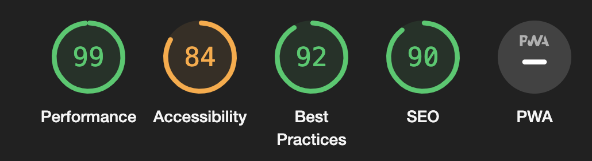
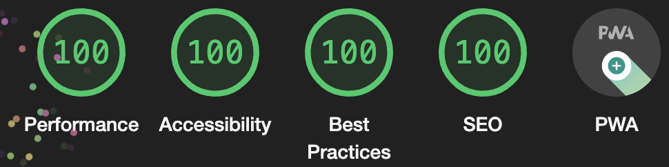

# RijksDigital

Welkom bij mijn project van [Progressive Web Apps](https://github.com/cmda-minor-web/progressive-web-apps-2122 "Minor link"). Bij dit project van de Minor 'Webdesign and development' is het de bedoeling dat we een single page app gaan maken. Dit is met behulp van de OBA API.

De website is [hier](https://rijksdigital.herokuapp.com/ "RijksDigital") te zien.


## Inhoudsopgave

- [User Story](#user-story)
- [Rendering](#rendering)
- [Installatie](#installatie)
- [API](#api)
- [Activity Diagram](#activity-diagram)
- [Service Worker](#service-worker)
- [Optimalisatie](#optimalisatie)
- [To do](#to-do)
- [Licence](#licence)
- [Credits](#credits)

## User Story ✍🏼

> As an art lover, I want to be able to search and view art from the Rijksmuseum at home, so that I can still enjoy art during a lockdown

## Rendering ⏳

#### Client side rendering

Bij client side rendering wordt alle content gerendered in de browser van de gebruiker. Hierdoor wordt alles naar 1 HTML file geladen en wordt de content pas laten zien als alles geladen is. Dit is alleen voordelig bij gebruikers met snelle internet connecties. De browser rendert namelijk alle content in de browser van de gebruiker.

#### Server side rendering

Bij server side rendering wordt de content op de server gerendered. Hierbij wordt alle content van een pagina, inclusief de data, gerendered op de server van de website. Hierdoor ziet de gebruiker geen half geladen websites als de connectie niet goed is. Het renderen wordt op de server gedaan, waardoor de connectie van de gebruiker niet uit maakt.

## Installatie ⚙️

#### Clonen 

Om de app lokaal te laten draaien moet het project eerst lokaal worden gecloned.
Als dit stukje code gerunt wordt in de terminal wordt de repository lokaal gecloned:

`gh repo clone tomvandenberg11/progressive-web-apps-2122.git`

Ga eerst naar de folder waarin je wilt dat het project gecloned wordt. Je kan in de terminal navigeren met `cd` met daar achter de map waar je heen wilt.

Daarna is het nodig om `node` en `npm` geinstalleerd te hebben op je lokale computer. Als je deze stappen gevolgd hebt, worden met `npm install` de benodigde packages gedownload.

#### Running

Als je de bovenstaande stappen gevolgd hebt kan de app opgestart worden door:

`npm run server`

te runnen in de terminal.
Je ziet dan een bericht in de terminal staan op welke link de app te zien is.

## Activity Diagram ➡️


## Service Worker 🏋🏻‍♀️
De service worker zorgt ervoor dat bepaalde bestanden gecached worden in het geval er geen internet connectie meer is. De bestanden die ik cache zijn:
```javascript
const CORE_ASSETS = [
    '/offline',
    '/style/style.css',
    '/script/script.js',
    '/images/logo.png',
    '/images/icon-512.jpg',
    'manifest.json'
]
```

Hierdoor zijn deze bestanden ook beschikbaar als er geen internet connecie is. De bestanden worden opgeslagen in de browser. 

## Optimalisaties 💨
Voordat ik optimalisatie aanpassingen had gedaan, kwamen er een aantal problemen naar voren. Bijvoorbeeld dat er geen `apple-touch-icon` is toegevoegd en dat de pagina niet scalable is. Het laatste probleem heb ik opgelost door `user-scalable=no` te verwijderen uit de head, zodat de gebruiker de pagina wel kan scalen.

Een ander probleem is dat mijn images als `background-image` in CSS werden getoond, in plaats van een `` tag. Dit heb ik toen verandert, zodat ik gebruik kan maken van `srcset`.


Ook heb ik compression en cache control toegevoegd aan de applicatie. Compression kan toegevoegd worden door de npm compression package te installeren. Cache control kan in express toegevoegd worden door het volgende stukje code:

```javascript
app.use(/.*-[0-9a-f]{10}\..*/, (req, res, next) => {
  res.setHeader('Cache-Control', 'max-age=365000000, immutable')
  next()
})
```

De font van de website heb ik ingeladen via de head van de website. Ik heb mijn font namelijk van Google Fonts. In de link is het mogelijk om display=swap aan te zetten, zodat eerst een fall-back font geladen wordt als het echte font nog niet gedownload is.

Voordat ik deze optimalisatie aanpassingen gedaan had, was dit mijn score in Chrome Lighthouse:


Nadat ik de optimalisatie aanpassingen heb geimplementeerd, is dit mijn score in Chrome Lighthouse:


## API 💿

Voor dit project heb ik de API van het Rijksmuseum gebruikt. De API is vrij te gebruiken en bevat zo goed als alle
schilderijen in het Rijksmuseum. Meer informatie over deze API vind je [hier](https://data.rijksmuseum.nl/object-metadata/api/).

Er is wel een key nodig om de API te gebruiken. Deze kan verkregen worden door een account aan te maken bij Rijksmuseum Studio. Daarna is de key te vinden in instellingen.

## To do ✅

| To do                                   | Done? |
|:----------------------------------------|:-----:|
| Empty results after search              |   ✅   |
| Error states                            |   ✅   |
| Implement search                        |   ✅   |
| Implement detail page                   |   ✅   |
| Implement detail page after search      |   ✅   |
| Fix error after too less search results |   ✅   |
| Increasing performance                  |   ✅   |
| Deploying on Heroku                     |   ✅   |

## Licence 👨🏻‍⚖️

Dit project is voorzien van een MIT licence. Zie de pagina LICENCE voor meer informatie.

## Credits 📣

Ik wil graag als eerste de docenten bedanken voor al hun inzet, uitleg en lesstof. Ten tweede wil ik mijn supportgroepje bedanken voor de mentale en functionele support. Ten derde wil ik Stackoverflow bedanken voor al hun antwoorden op mijn vragen.
