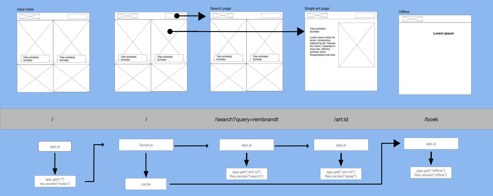

# RijksDigital

Welkom bij mijn project van [Progressive Web Apps](https://github.com/cmda-minor-web/web-app-from-scratch-2122 "Minor link"). Bij dit project van de Minor 'Webdesign and development' is het de bedoeling dat we een single page app gaan maken. Dit is met behulp van de OBA API.

De website is [hier](https://rijksdigital.herokuapp.com/ "RijksDigital") te zien.

## Inhoudsopgave

- [User Story](#user-story)
- [Activity Diagram](#activity-diagram)
- [Hoe te gebruiken?](#hoe-te-gebruiken)
- [Installatie](#installatie)
- [API](#api)
- [To do](#to-do)
- [Licence](#licence)
- [Credits](#credits)

## User Story

> As an art lover, I want to be able to search and view art from the Rijksmuseum at home, so that I can still enjoy art during a lockdown

## Activity Diagram

## Installatie ⚙️

Om de app lokaal te laten draaien moet het project eerst lokaal worden gecloned. Als dit stukje code gerunt wordt in de terminal wordt de repository lokaal gecloned:

`gh repo clone tomvandenberg11/progressive-web-apps-2122.git`

Ga eerst naar de folder waarin je wilt dat het project gecloned wordt. Je kan in de terminal navigeren met cd met daar achter de map waar je heen wilt.

Daarna is het nodig om node en npm geinstalleerd te hebben op je lokale computer. Als je deze stappen gevolgd hebt, worden met npm install de benodigde packages gedownload.

`gh repo clone tomvandenberg11/oba-ondernemen`

Ga eerst naar de folder waarin je wilt dat het project gecloned wordt. Je kan in de terminal navigeren met `cd` met daar achter de map waar je heen wilt.

Hierna kan het bestand gewoon geopend worden in de browser door dubbel te klikken op de `index.html`.

Soms is het nodig om de app te draaien door middel van een server. Via VS Code kan dit via de live server extension.

## API

Voor dit project heb ik de API van het Rijksmuseum gebruikt. De API is vrij te gebruiken en bevat zo goed als alle
schilderijen in het Rijksmuseum. Meer informatie over deze API vind je [hier](https://data.rijksmuseum.nl/object-metadata/api/).

## To do

| To do                                   | Done? |
|:----------------------------------------|:-----:|
| Making search work                      |   ✅   |
| Empty results after search              |   ✅   |
| Error states                            |       |
| Loading states                          |       |
| Implement search                        |   ✅   |
| Implement detail page                   |   ✅   |
| Implement detail page after search      |   ✅   |
| Fix error after too less search results |   ✅   |

## Licence 👨🏻‍⚖️

Dit project is voorzien van een MIT licence. Zie de pagina LICENCE voor meer informatie.

## Credits 📣

Ik wil graag als eerste de docenten bedanken voor al hun inzet, uitleg en lesstof. Ten tweede wil ik mijn supportgroepje bedanken voor de mentale en functionele support. Ten derde wil ik Stackoverflow bedanken voor al hun antwoorden op mijn vragen.
